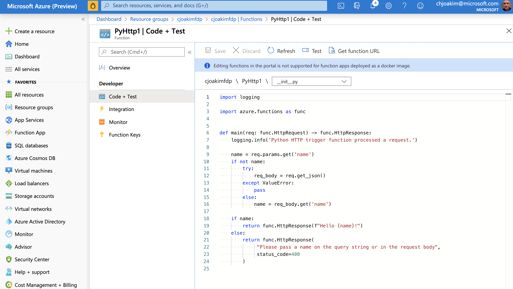

# azure-functions-docker

Azure Functions, implemented with Docker Containers and Python

---

## Links

- https://docs.microsoft.com/en-us/azure/azure-functions/
- https://docs.microsoft.com/en-us/azure/azure-functions/functions-create-function-linux-custom-image
- https://hub.docker.com/_/microsoft-azure-functions-base
- https://hub.docker.com/_/microsoft-azure-functions-python
- https://docs.microsoft.com/en-us/azure/azure-functions/functions-reference-python
- https://docs.microsoft.com/en-us/python/api/azure-functions/azure.functions?view=azure-python
- https://docs.microsoft.com/en-us/azure/azure-functions/functions-bindings-cosmosdb-v2-output?tabs=python
- https://docs.microsoft.com/en-us/azure/azure-functions/machine-learning-pytorch?tabs=bash

---

## Create a Function on Workstation with Azure Functions Core Tools and CLI

This example uses macOS, bash, the Azure CLI, python 3, and Terminal.

### Install and Explore the Azure Functions program; **func**

Install version 2.x of the tools with Node.js
```
$npm install -g azure-functions-core-tools
```

Explore:
```
$ func --version
2.7.2508

$ func --help

$ func templates list
```

[Output from 'func templates list'](func-templates-list.md)

### Initialize the Functions Project

```
$ cd azure-functions-docker    (root directory of this GitHub repository)
$ python3 -m venv .
$ source bin/activate
$ python --version  
Python 3.7.7
$ pip --version
pip 19.2.3 from ... (python 3.7)

$ func init PythonFunctionsProject --worker-runtime python --docker
Found Python version 3.7.7 (python).
Writing .gitignore
Writing host.json
Writing local.settings.json
Writing /Users/cjoakim/github/azure-functions-docker/PythonFunctionsProject/.vscode/extensions.json
Writing Dockerfile
Writing .dockerignore

$ cd PythonFunctionsProject/
```

---

### Create a HTTP-Triggered Function within the Functions Project

#### Generate It

```
$ func new --name PyHttp1 --template "HTTP trigger"
...
The function "PyHttp1" was created successfully from the "HTTP trigger" template.
```

#### Test it on your Local Workstation

```
$ func start
Found Python version 3.7.7 (python).

                  %%%%%%
                 %%%%%%
            @   %%%%%%    @
          @@   %%%%%%      @@
       @@@    %%%%%%%%%%%    @@@
     @@      %%%%%%%%%%        @@
       @@         %%%%       @@
         @@      %%%       @@
           @@    %%      @@
                %%
                %

Azure Functions Core Tools (2.7.2254 Commit hash: ae06bd1a6012aa6a0859b5f30d3077947267d2b6)
Function Runtime Version: 2.0.13017.0
...

In another terminal window:
$ curl "http://localhost:7071/api/PyHttp1?name=Miles"
Hello Miles!

In original terminal window, stop the Function App with Control-C:
[5/11/20 5:35:54 PM] Stopping JobHost
[5/11/20 5:35:54 PM] Job host stopped
[5/11/20 5:35:54 PM] Host shutdown completed.
```

#### Build the Docker Image

```
$ docker build --tag cjoakim/azurepythonfunctions:v1.0.0 .
Sending build context to Docker daemon   12.8kB
Step 1/5 : FROM mcr.microsoft.com/azure-functions/python:2.0-python3.7
2.0-python3.7: Pulling from azure-functions/python
804555ee0376: Pull complete
7c9d59a5418f: Pull complete
e479e8a224dd: Pull complete
a78043528ca1: Pull complete
14a3521a917e: Pull complete
4d4ad3e8ee93: Pull complete
f7038761ec60: Pull complete
a8dccab2606b: Pull complete
ab2b5ddf6388: Pull complete
Digest: sha256:0fb62a3e7e5a39d85ad66af4a788a62363410a0fea26a74fa9b865b457d0eb04
Status: Downloaded newer image for mcr.microsoft.com/azure-functions/python:2.0-python3.7
 ---> 4b51b78aab24
Step 2/5 : ENV AzureWebJobsScriptRoot=/home/site/wwwroot     AzureFunctionsJobHost__Logging__Console__IsEnabled=true
 ---> Running in 0a9ea1c633a8
Removing intermediate container 0a9ea1c633a8
 ---> 04fdc752127e
Step 3/5 : COPY requirements.txt /
 ---> 47c4eb48ebd6
Step 4/5 : RUN pip install -r /requirements.txt
 ---> Running in 6030860a2f88
Collecting azure-functions
  Downloading https://files.pythonhosted.org/packages/5b/6d/67a219c38be7e4eae7c001a9bf83ab059dcf497644ccc6c5f696ea4155fa/azure_functions-1.2.1-py3-none-any.whl (114kB)
Installing collected packages: azure-functions
Successfully installed azure-functions-1.2.1
WARNING: You are using pip version 19.3.1; however, version 20.1 is available.
You should consider upgrading via the 'pip install --upgrade pip' command.
Removing intermediate container 6030860a2f88
 ---> a4f5fe7f2422
Step 5/5 : COPY . /home/site/wwwroot
 ---> 831c6e41739c
Successfully built 831c6e41739c
Successfully tagged cjoakim/azurepythonfunctions:v1.0.0
```

#### Test the Docker Image on your Local Workstation

```
$ docker run -p 3000:80 -it cjoakim/azurepythonfunctions:v1.0.0
...
Initializing function HTTP routes
Mapped function route 'api/PyHttp1' [get,post] to 'PyHttp1'
...

Invoke http://localhost:3000/ with your browser and see the following page (image below).

Then stop the Function App with Control-C
```


#### Push the Docker Image to a Container Registry

This example uses **DockerHub** for public demonstration purposes.
An actual production Azure application should use **Azure Container Registry**.

```
docker push cjoakim/azurepythonfunctions:v1.0.0
```

---

### Provision Azure Resources and your Azure Function App

First, edit **env.sh** with **your** Azure configuration values.

Then, execute the following two scripts in sequence.  These use the Azure CLI (az program).
These scripts use the **bash** shell, but the **az** commands are identical on Windows or Linux.

```
$ provision-1-app.sh
$ provision-2-config-storage.sh
```

---

### Get the URL for your Function in Azure Portal

Click the **Get Function URL** link on this page:



---

### Invoke the HTTP-Triggered Azure Function with a HTTP Client Program

Use your tool-of-choice; **curl** is shown here:

```
curl "https://cjoakimfdp.azurewebsites.net/api/PyHttp1?code=<secret>&name=Joakim"

Hello Joakim!
```

---

### Cleanup

Delete the Azure Resource Group and its' contents.
```
$ provision-9-delete.sh
```
